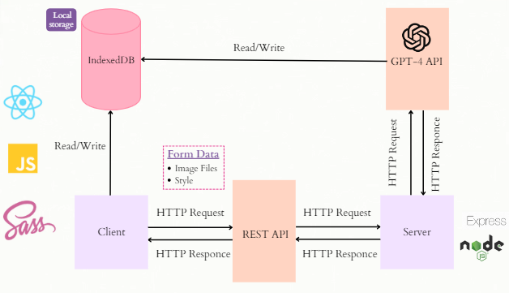

<h1 align="center">WARDROBE WIZARD</h1>

 

 

 

 

- The project used **React.js, JavaScript, SASS** for the front-end development.
- For data persistence, we used **IndexedDB** to store images and outfit combinations in the client side.
- The server and RESTful api was designed with **Node.js with Express.js**.
- The main feature of outfit suggestion was powered by OpenAI API, GPT-4 vision model.

---

<h2><strong>Key Features</h2></strong>

- Easy upload of images and virtual closet creation.
- Style selection to customize recommendations.
- Expert fashion guidance provided by an AI-powered advisor.
- Intuitive design ensures a seamless user experience.
  

 

---

<h2><strong>Project Architecture</h2></strong>

 

---

<h2><strong>Screenshots</strong></h2>
 

   
  <b>1)</b> Homepage of <i><b>Wardrobe Wizard</b></i>
    
   
     
  <b>2)</b> Drag and drop your outfits into the <b>image uploader</b> box or select them from your files
    
   
     
  <b>3)</b> Select your style from the given options below and click on <b>Ask Advisor</b> to get recommendations from our AI Assistant
    
   
     
  <b>4)</b> The <b>recommendations</b> page is shown
    
   
     
  <b>4)</b> Each <b>recommendation card</b> consists of the <b>images</b> of the outfit, the <b>score</b> given to it according to how nicely it matches the desired style and a short <b>description</b> for the outfit combination.
   First two <b>recommendations</b> that got generated
    
   
     
  <b>4)</b> Next two <b>recommendations</b> that got generated
    
   
     
  <b>4)</b> Click on the <b>Try New Looks</b> button to create more outfit combinations
    
   

